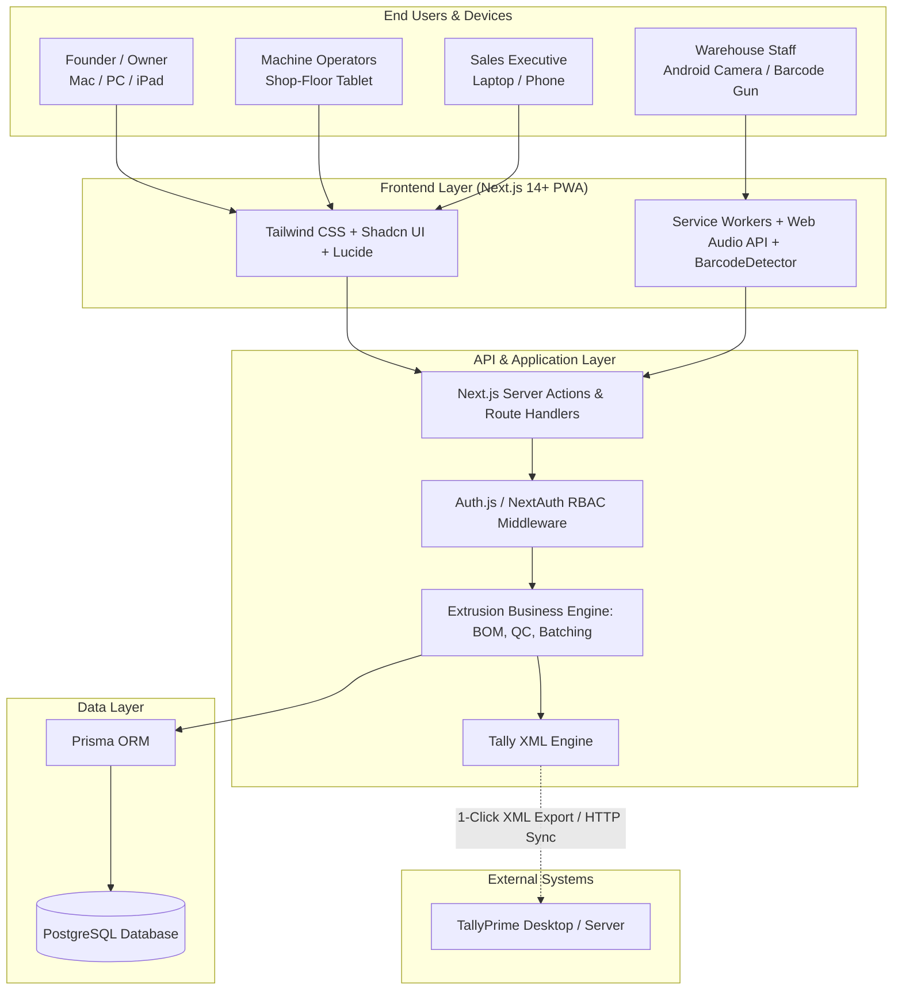
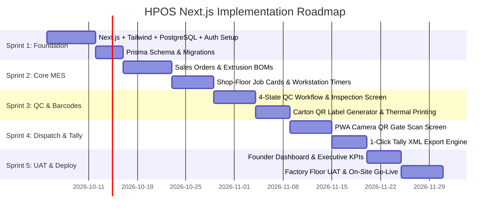

# HPOS Next.js Implementation Plan & Architecture Blueprint
## Himalaya Plast Operating System: Bespoke Manufacturing Execution System (MES) & Factory OS

---

## 1. Executive Summary & Client Decision Matrix

This document provides a side-by-side strategic comparison and an end-to-end technical implementation plan for **Himalaya Plast**. 

The client will choose between two distinct software delivery models:

1. **Option A: The ERPNext + `hpos_extensions` Route (Current Working Build)**
   - Complete enterprise system with native double-entry ledger, purchasing, stock, manufacturing, and India Compliance GST e-invoicing built inside one unified framework.
2. **Option B: The Proprietary Next.js Factory OS + Tally Route (Bespoke Product)**
   - A streamlined, ultra-fast, mobile-first Manufacturing Execution System (MES) built specifically for plastic extrusion, eliminating all ERP bloat. Day-to-day accounting remains in **TallyPrime**, with automated 1-click invoice export.

---

### Side-by-Side Comparison

| Dimension | Option A: ERPNext + `hpos_extensions` | Option B: Bespoke Next.js + PostgreSQL + Tally |
|---|---|---|
| **Primary Philosophy** | Full All-in-One Enterprise ERP | Lightweight, High-Velocity Factory OS (MES) |
| **User Experience (UI/UX)** | Native Frappe Desk forms + 3 custom Vue 3 screens | 100% custom, modern, consumer-grade speed (Tailwind + Next.js App Router) |
| **Shop-Floor Simplicity** | Operators see Frappe Desk sidebars (unless heavily restricted) | Dedicated tablet/mobile screens with zero clutter, big buttons, high contrast |
| **Accounting & GST** | Native Double-Entry General Ledger + India Compliance e-Invoicing app | Factory generates commercial dispatch notes; **1-click XML sync to TallyPrime** where the CA does GST |
| **System Complexity** | High (hundreds of doctypes, database tables, and ERP modules) | Minimal (only 12–15 focused tables matching extrusion operations) |
| **Deployment & Hosting** | Frappe Cloud ($25 – $50 / month) or self-hosted Docker VPS | Vercel / Railway + Supabase ($15 – $25 / month) or single low-cost VPS |
| **IP & Commercialization** | Tied to Frappe ecosystem (GPL license constraints) | **100% proprietary code** owned by Param; can be white-labeled & sold to other extrusion factories |
| **Current Status** | **100% Built, Tested, & Verified on localhost:8000** | Ready to be built using our proven schemas and API contracts |

---

## 2. Next.js System Architecture



---

## 3. Database Schema Design (Prisma / PostgreSQL)

Mapped directly from our proven HPOS Data Model:

```prisma
datasource db {
  provider = "postgresql"
  url      = env("DATABASE_URL")
}

generator client {
  provider = "prisma-client-js"
}

// ----------------------------------------------------
// 1. AUTH & ROLES
// ----------------------------------------------------
enum UserRole {
  FOUNDER
  ADMIN
  SALES
  PLANNER
  OPERATOR
  WAREHOUSE_SCAN
  ACCOUNTS
}

model User {
  id           String    @id @default(cuid())
  email        String    @unique
  name         String
  passwordHash String
  role         UserRole
  active       Boolean   @default(true)
  employeeCode String?   @unique
  assignedMachineId String?
  createdAt    DateTime  @default(now())
  updatedAt    DateTime  @updatedAt

  jobCards     JobCard[]
  scannedCartons CartonLabel[] @relation("CartonScanner")
}

// ----------------------------------------------------
// 2. MASTER DATA
// ----------------------------------------------------
enum ItemCategory {
  RAW_MATERIAL
  FINISHED_GOODS
  PACKAGING
  SCRAP
}

model Item {
  id           String       @id @default(cuid())
  code         String       @unique
  name         String
  category     ItemCategory
  uom          String       // Meter, Kg, Nos
  hsnCode      String?      // e.g. 39169090
  standardCost Decimal      @default(0) @db.Decimal(12, 2)
  minStockLevel Float       @default(0)
  batches      Batch[]
  boms         BOM[]
}

model Workstation {
  id          String    @id @default(cuid())
  code        String    @unique // e.g. LINE-01
  name        String    // Extrusion Line 01
  hourlyRate  Decimal   @db.Decimal(10, 2)
  status      String    @default("IDLE") // RUNNING, IDLE, MAINTENANCE
  jobCards    JobCard[]
}

model Batch {
  id           String    @id @default(cuid())
  batchNumber  String    @unique // BATCH-RM-00001 or BATCH-FG-00001
  itemId       String
  item         Item      @relation(fields: [itemId], references: [id])
  quantity     Float
  uom          String
  source       String    // PURCHASE, EXTRUSION
  parentBatchId String?  // For backward genealogy
  createdAt    DateTime  @default(now())

  cartons      CartonLabel[]
}

// ----------------------------------------------------
// 3. SELLING & PRODUCTION
// ----------------------------------------------------
enum ApprovalMethod {
  WHATSAPP
  EMAIL
  PHONE
  VERBAL
}

enum OrderStatus {
  DRAFT
  APPROVED
  IN_PRODUCTION
  READY_TO_DISPATCH
  DISPATCHED
  COMPLETED
  CANCELLED
}

model SalesOrder {
  id              String         @id @default(cuid())
  orderNumber     String         @unique // SAL-ORD-2026-00001
  customerName    String
  customerGstin   String?
  transactionDate DateTime       @default(now())
  deliveryDate    DateTime
  status          OrderStatus    @default(DRAFT)
  approvalMethod  ApprovalMethod
  totalAmount     Decimal        @db.Decimal(12, 2)
  notes           String?
  
  items           SalesOrderItem[]
  workOrders      WorkOrder[]
  deliveryNotes   DeliveryNote[]
}

model SalesOrderItem {
  id           String     @id @default(cuid())
  salesOrderId String
  salesOrder   SalesOrder @relation(fields: [salesOrderId], references: [id], onDelete: Cascade)
  itemId       String
  qty          Float
  rate         Decimal    @db.Decimal(10, 2)
  amount       Decimal    @db.Decimal(12, 2)
}

model BOM {
  id           String    @id @default(cuid())
  name         String
  fgItemId     String
  fgItem       Item      @relation(fields: [fgItemId], references: [id])
  outputQty    Float     @default(1.0)
  scrapFactor  Float     @default(0.025) // 2.5% standard purge allowance
  
  materials    BOMItem[]
}

model BOMItem {
  id           String    @id @default(cuid())
  bomId        String
  bom          BOM       @relation(fields: [bomId], references: [id], onDelete: Cascade)
  rmItemId     String
  qtyPerUnit   Float
}

model WorkOrder {
  id              String      @id @default(cuid())
  workOrderNumber String      @unique // MFG-WO-2026-00001
  salesOrderId    String?
  salesOrder      SalesOrder? @relation(fields: [salesOrderId], references: [id])
  fgItemId        String
  plannedQty      Float
  producedQty     Float       @default(0)
  status          String      @default("PENDING") // PENDING, IN_PROGRESS, COMPLETED
  fgBatchNumber   String?
  startDate       DateTime?
  endDate         DateTime?

  jobCards        JobCard[]
}

model JobCard {
  id              String       @id @default(cuid())
  workOrderId     String
  workOrder       WorkOrder    @relation(fields: [workOrderId], references: [id], onDelete: Cascade)
  workstationId   String
  workstation     Workstation  @relation(fields: [workstationId], references: [id])
  assignedUserId  String?
  assignedUser    User?        @relation(fields: [assignedUserId], references: [id])
  status          String       @default("QUEUED") // QUEUED, ACTIVE, COMPLETED
  goodQty         Float        @default(0)
  scrapQty        Float        @default(0)
  startedAt       DateTime?
  completedAt     DateTime?
  
  inspections     QualityInspection[]
}

// ----------------------------------------------------
// 4. QUALITY MANAGEMENT (4-STATE WORKFLOW)
// ----------------------------------------------------
enum QCStatus {
  DRAFT
  PASS
  REJECT
  SCRAP
  REWORK
}

model QualityInspection {
  id            String    @id @default(cuid())
  reportNumber  String    @unique // QC-2026-00001
  jobCardId     String?
  jobCard       JobCard?  @relation(fields: [jobCardId], references: [id])
  batchNumber   String
  status        QCStatus  @default(DRAFT)
  sampleSize    Int       @default(5)
  pinSize       Float?    // mm
  width         Float?    // mm
  legThickness  Float?    // mm
  linearWeight  Float?    // g/m
  fitTestResult String?   // PASS / FAIL
  inspectorName String
  inspectedAt   DateTime  @default(now())
  reworkNotes   String?
}

// ----------------------------------------------------
// 5. PACKING & DISPATCH GATE SCAN
// ----------------------------------------------------
model CartonLabel {
  id                   String        @id @default(cuid())
  cartonCode           String        @unique // HP-CTN-BATCH-FG-00001-00001-001
  deliveryNoteId       String
  deliveryNote         DeliveryNote  @relation(fields: [deliveryNoteId], references: [id])
  batchId              String
  batch                Batch         @relation(fields: [batchId], references: [id])
  quantity             Float
  scanned              Boolean       @default(false)
  scannedById          String?
  scannedBy            User?         @relation("CartonScanner", fields: [scannedById], references: [id])
  scannedAt            DateTime?
  dispatchConfirmed    Boolean       @default(false)
  dispatchOverride     Boolean       @default(false)
  dispatchOverrideNote String?
}

model DeliveryNote {
  id              String        @id @default(cuid())
  dnNumber        String        @unique // DN-26-00001
  salesOrderId    String
  salesOrder      SalesOrder    @relation(fields: [salesOrderId], references: [id])
  customerName    String
  transporterName String?
  vehicleNumber   String?
  lrNumber        String?
  status          String        @default("DRAFT") // DRAFT, DISPATCHED, DELIVERED
  dispatchedAt    DateTime?
  
  cartons         CartonLabel[]
}

// ----------------------------------------------------
// 6. TALLY INTEGRATION AUDIT
// ----------------------------------------------------
model TallySyncLog {
  id           String    @id @default(cuid())
  documentType String    // SALES_INVOICE, RECEIPT
  documentId   String
  exportedXml  String    @db.Text
  status       String    // SUCCESS, PENDING, ERROR
  syncedAt     DateTime  @default(now())
  errorMessage String?
}
```

---

## 4. The 7 Core Next.js Modules & User Experience

### Module 1: Sales Order Hub & Customer Approvals
- **Interface:** High-contrast list of active orders with WhatsApp / Email badges.
- **Workflow:** One-click conversion of inquiry to order. Enforces `Approval Method` before order can move to production.

### Module 2: Extrusion Execution & Digital Job Cards
- **Interface:** Tablet-optimized for shop-floor operators.
- **Features:** 
  - Operator selects machine (`Extrusion Line 01`).
  - Displays target extrusion profile drawing, material formulation, and target RPM/heat zones.
  - Big `Start Run`, `Record Purge/Scrap`, and `Complete Run` buttons (minimum 52px touch targets).

### Module 3: 4-State Quality Assurance Station
- **Interface:** Dedicated QC iPad / tablet screen.
- **Workflow:** 
  - Measures Pin Size, Width, Leg, and Linear Weight.
  - One-tap status buttons: **Pass (Green)**, **Rework (Orange)**, **Reject/Scrap (Red)**.
  - Marking `Rework` instantly flags the batch and creates an internal return routing entry.

### Module 4: Automatic Carton Label & QR Generator
- **Interface:** Warehouse packing station.
- **Workflow:** 
  - When a work order completes, packing team inputs: `Case 1: 50 Nos`, `Case 2: 50 Nos`.
  - Automatically prints thermal labels with scannable QR code (`HP-CTN-{batch}-{case}`).
  - Directly interfaces with Zebra/TVS thermal label printers via Web Print API or raw ESC/POS.

### Module 5: Mobile QR Dispatch Gate Scanner (PWA)
- **Interface:** Full-viewport mobile web app accessible via smartphone camera or rugged Android barcode scanner.
- **Features:**
  - Viewfinder with green animated laser line reticle.
  - Large **X / Y Cartons Scanned** counter legible from 6 feet away.
  - Immediate audio feedback (pleasant two-tone chime for match, low warning buzz for mismatch/duplicate).
  - Override prompt modal requiring supervisor reason if counts do not reconcile.

### Module 6: Founder Executive Command Center
- **Interface:** Single-screen desktop/tablet dashboard for the business owner.
- **Features:**
  - **Live Factory Health Score (0–100):** Weighted computation of on-time delivery %, QC reject rate, and capacity utilization.
  - 4 Real-time cards: At-Risk Orders, Overdue Dispatches, Machine Line Status, Today's Output.
  - Drill-down modals showing exact order details in <100ms.

### Module 7: 1-Click TallyPrime XML Sync
- **Interface:** Accounts sync tab.
- **Workflow:**
  - When goods are scanned and dispatched, a commercial invoice is finalized.
  - Accountant clicks **"Export to Tally"** &rarr; downloads standard Tally XML or pushes directly to Tally via local HTTP port 9000.
  - Creates the Sales Voucher in Tally automatically with correct ledger heads (Sales Account, CGST, SGST, IGST, Round-off).

---

## 5. Development Roadmap & Timeline

If the client chooses Option B (Next.js), here is the 6-week execution schedule:



| Phase | Duration | Key Milestone Deliverable |
|---|---|---|
| **Sprint 1: Architecture & Foundation** | Week 1 | Next.js 14 App Router, PostgreSQL on Supabase/Railway, Prisma models, Auth.js with 5 roles. |
| **Sprint 2: Sales & Shop-Floor Execution** | Week 2 | Sales order approval flow, Work Orders, Extrusion machine Job Card operator UI. |
| **Sprint 3: Quality & Carton Barcoding** | Week 3 | 4-state QC modal, auto-carton generation, thermal label print layout with QR codes. |
| **Sprint 4: Mobile Gate Scan & Tally Sync** | Week 4 | Full-viewport PWA camera scan with audio/haptics, override modal, Tally XML sales voucher generator. |
| **Sprint 5: Executive Dashboard & Polish** | Week 5 | Single-screen Founder Dashboard, Health Score algorithm, multi-device responsiveness testing. |
| **Sprint 6: Factory UAT & Cutover** | Week 6 | On-site testing with printed labels and shop-floor Android devices; team training & go-live. |

---

## 6. Infrastructure & Monthly Running Costs

| Component | Option A (ERPNext on Frappe Cloud) | Option B (Next.js + Managed Cloud) |
|---|---|---|
| **Application Hosting** | Frappe Cloud: $25 – $50 / month | Vercel Pro ($20/mo) or Railway ($10/mo) |
| **Database** | Included in Frappe Cloud | Supabase Pro ($25/mo) or Neon ($19/mo) |
| **Domain & SSL** | Included | Included |
| **Total Monthly Cost** | **~$25 to $50 / month** | **~$25 to $40 / month** |
| **Lock-in Risk** | Tied to Frappe ecosystem & bench CLI | Zero lock-in (standard React/Next.js + Postgres) |

---

## 7. How to Present This Choice to Himalaya Plast

When presenting to the Founder of Himalaya Plast, frame the choice around **how their office operates**:

### The Pitch:

> *"Mr. Founder, we have already completely built and verified your entire operational workflow in a working prototype on localhost.*
>
> *Now, you have a strategic choice between two paths:*
>
> 1. ***Path 1 (Full ERPNext Suite):*** *We deploy the working ERPNext system to Frappe Cloud. It handles your general ledger accounting, inventory, and GST e-invoicing inside one big system. It is enterprise-grade, but has more complex menus and forms.*
> 2. ***Path 2 (Bespoke Next.js Factory OS + Tally):*** *We deploy a custom, ultra-fast, tailored web app that looks and feels like a modern iPhone app. Your shop floor gets super-simple Job Cards, 4-state QC, and camera carton dispatch scanning. Your accounts team never has to leave **Tally**—the dispatch data exports straight to Tally in 1 click.*
>
> *Both paths solve your batch traceability, paperless shop floor, and gate dispatch verification."*
