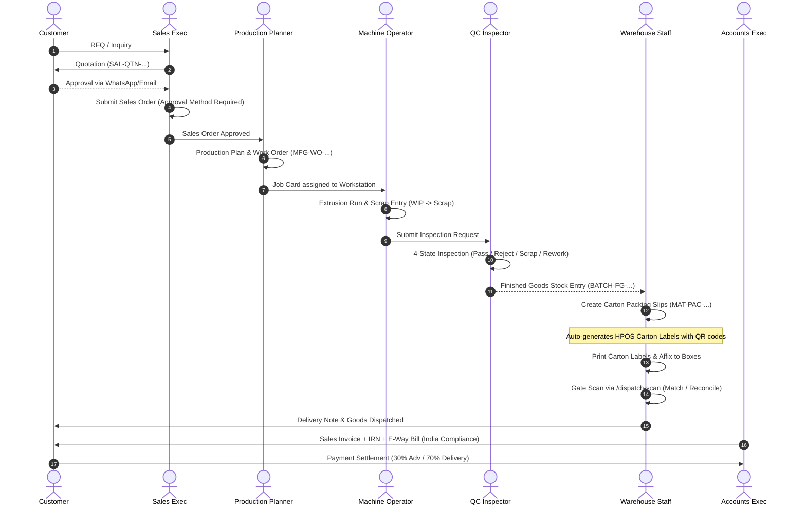
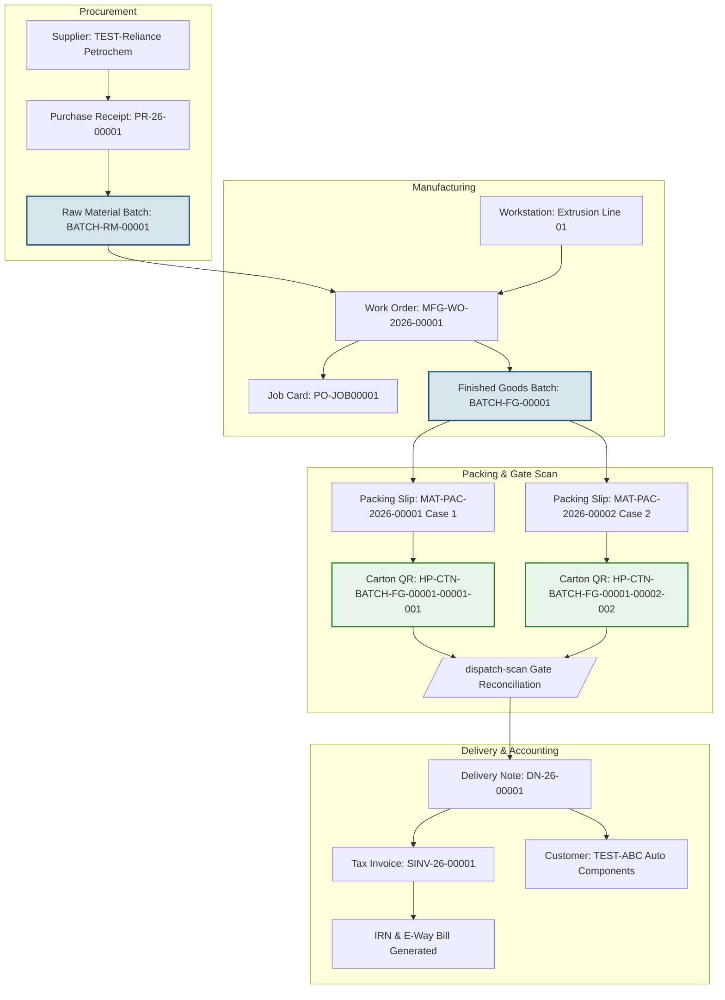

# Himalaya Plast Operating System (HPOS)

[](https://frappeframework.com/)
[](https://erpnext.com/)
[](https://github.com/resilient-tech/india-compliance)
[](https://vuejs.org/)
[](https://opensource.org/licenses/MIT)

An end-to-end Enterprise Resource Planning (ERP) and Factory Operations System built for **Himalaya Plast** — an industrial manufacturer of precision **uPVC gaskets** and **TPE extrusion profiles** based in Gujarat, India.

Built on **Frappe Framework v15**, **ERPNext v15**, **India Compliance**, and the custom app **`hpos_extensions`**.

---

## Table of Contents

1. [Executive Summary](#executive-summary)
2. [What We Have Built](#what-we-have-built)
   - [Core Native Modules](#1-core-native-modules)
   - [Custom Screens (Phase 2 Subset)](#2-custom-screens-phase-2-subset)
   - [Compliance & Audit Trail](#3-compliance--audit-trail)
3. [How the System Works](#how-the-system-works)
   - [End-to-End Order-to-Cash Data Flow](#end-to-end-order-to-cash-data-flow)
   - [Batch Traceability & Genealogy Flow](#batch-traceability--genealogy-flow)
   - [Custom App Architecture (`hpos_extensions`)](#custom-app-architecture-hpos_extensions)
4. [How to Run & Operate Locally](#how-to-run--operate-locally)
   - [Prerequisites](#prerequisites)
   - [Starting the Development Server](#starting-the-development-server)
   - [Access URLs & Test Credentials](#access-urls--test-credentials)
   - [Guided Walkthrough of Custom Screens](#guided-walkthrough-of-custom-screens)
5. [Automated Verification & Test Suites](#automated-verification--test-suites)
6. [Deploying to Frappe Cloud](#deploying-to-frappe-cloud)
7. [Consolidated Client Open Items Checklist](#consolidated-client-open-items-checklist)

---

## Executive Summary

Himalaya Plast operates continuous plastic extrusion lines converting PVC resin and additives into precision gaskets for architectural and automotive applications. 

HPOS transforms their factory operations from fragmented paper logs into a unified, digital system delivering:
- **Zero Paperwork:** Complete digital job cards, QC inspections, carton generation, and gate passes.
- **100% Batch Genealogy:** Complete forward and backward traceability from supplier raw material batches (`BATCH-RM-...`) through extrusion work orders to finished goods cartons (`HP-CTN-...`).
- **Automated GST & E-Way Compliance:** Real-time B2B electronic invoice (IRN), signed QR code, and E-Way Bill generation via India Compliance.
- **Role-Based Security:** Factory machine operators are row-isolated to their own machines; warehouse scan tablets have zero administrative desk access; financial health is restricted to the founder.
- **100% Reproducible Cloud Deployment:** All custom configurations, doctypes, roles, and print formats are exported as code fixtures, enabling single-command deployment to Frappe Cloud with zero manual UI steps.

---

## What We Have Built

HPOS was delivered through an exhaustive 13-milestone sequence ([Prompts 00 through 12](file:///z:/Projects/himalaya%20plast/DOCS%20FOR%20HPOS/files/PROGRESS.md)):

### 1. Core Native Modules

#### Selling Module ([Prompt 01](file:///z:/Projects/himalaya%20plast/DOCS%20FOR%20HPOS/files/01_selling.md))
- Quotation to Sales Order lifecycle configured for industrial B2B manufacturing.
- Mandatory custom field `approval_method` (`Email`, `WhatsApp`, `Phone`, `Verbal`) enforced by Python server-side hook (`validate_sales_order`) and client-side Desk script.
- Branded Jinja Print Format **`HPOS Sales Order`** with `#1B4F72` industrial styling, GSTIN, and customer order metadata.

#### Buying Module ([Prompt 02](file:///z:/Projects/himalaya%20plast/DOCS%20FOR%20HPOS/files/02_buying.md))
- Procure-to-pay workflow with 3-way reconciliation (Purchase Order &rarr; Purchase Receipt &rarr; Purchase Invoice).
- Automatic batch creation for raw material inwards (`BATCH-RM-.#####`, e.g., `TEST-PVC-RESIN`).
- Enforced incoming Quality Inspection gating before raw material consumption can occur on the shop floor.

#### Stock & Inventory ([Prompt 03](file:///z:/Projects/himalaya%20plast/DOCS%20FOR%20HPOS/files/03_stock.md))
- Multi-tier Item Group hierarchy:
  - `Raw Material` (`uPVC Compound`, `TPE Compound`, `Additives and Colorants`)
  - `Finished Goods` (`uPVC Gaskets`, `TPE Extrusion Profiles`)
  - `Packaging and Consumables` (`Cartons and Boxes`, `Labels and Tapes`)
  - `Scrap and Process Loss` (Recyclable purge and edge trim)
- Structured warehouse locations: `Stores - HP` (Raw materials), `Work In Progress - HP` (Extrusion lines), `Finished Goods - HP` (Bonded dispatch store).

#### Manufacturing & Extrusion ([Prompt 04](file:///z:/Projects/himalaya%20plast/DOCS%20FOR%20HPOS/files/04_manufacturing.md))
- Machine workstations (`Extrusion Line 01`) with runtime capacity and hourly costing.
- Multi-item Bill of Materials (BOM) with engineered 2.5% scrap/purge allowance tied to `Scrap and Process Loss`.
- Production Plan generation, Work Order execution, and Job Card time logs with operator assignment validation.
- Finished Goods batch generation (`BATCH-FG-.#####`, e.g., `BATCH-FG-00001`).

#### Quality Management 4-State Workflow ([Prompt 05](file:///z:/Projects/himalaya%20plast/DOCS%20FOR%20HPOS/files/05_quality.md))
- Upgraded standard binary Accepted/Rejected QC into an industrial **4-State Workflow**: `Draft` &rarr; `Pass`, `Reject`, `Scrap`, `Rework`.
- Automated stock routing: marking an inspection as `Reject` automatically drafts a linked `Stock Entry (Rework)` moving material from Finished Goods to WIP.
- Quality Inspection Templates with dimensional parameters: `Pin Size`, `Width`, `Leg`, `Weight`, `Profile Fit Test`, `K-Value`, `Moisture Content`.

#### Packing & Dispatch Reconciliation ([Prompt 06](file:///z:/Projects/himalaya%20plast/DOCS%20FOR%20HPOS/files/06_dispatch.md))
- Carton-wise Packing Slips (`MAT-PAC-2026-00001` & `00002`) reconciling case counts against Delivery Notes (`DN-26-00001`).
- Native transporter and e-way logistics fields: `transporter_name`, `vehicle_no`, `lr_no`, `lr_date`, `mode_of_transport`.

#### Accounts, GST & India Compliance ([Prompt 07](file:///z:/Projects/himalaya%20plast/DOCS%20FOR%20HPOS/files/07_accounts.md))
- Configured India Compliance app with electronic invoicing (e-Invoice): generates IRN hash, acknowledgement number, and dynamic signed QR code.
- E-Way bill generation linked directly to submitted sales invoices.
- Standard B2B payment terms schedule (`30% Advance`, `70% On Delivery / 30 Days`).
- Custom Jinja Print Format **`HPOS Tax Invoice`** featuring GSTINs, IRN bar, dynamic QR code image, and payment terms table.

#### Role-Based Access Control (RBAC) ([Prompt 08](file:///z:/Projects/himalaya%20plast/DOCS%20FOR%20HPOS/files/08_rbac.md))
- Custom Roles: `HPOS Founder` (Read-only aggregate visibility), `HPOS Operator` (Shop-floor execution), `HPOS Warehouse Scan` (Minimal gate device role).
- 25 custom permission matrix rules (`Custom DocPerm`).
- Server-side row-level isolation hooks (`permission_query_conditions` and `has_permission` on `Job Card`): Machine operators can **only** see and log time on their own assigned machine jobs.

---

### 2. Custom Screens (Phase 2 Subset)

#### Screen 1: Order Timeline ([Prompt 09](file:///z:/Projects/himalaya%20plast/DOCS%20FOR%20HPOS/files/09_order_timeline.md))
- **URL:** [`/app/order-timeline`](http://localhost:8000/app/order-timeline)
- Built with **Vue 3**, **Vite**, and **Lucide Icons** embedded natively inside the Frappe Desk.
- Aggregates the 9-stage lifecycle: `Quotation` &rarr; `Sales Order` &rarr; `Production Plan` &rarr; `Work Order` &rarr; `Job Card` &rarr; `Quality Inspection` &rarr; `Packing Slip` &rarr; `Delivery Note` &rarr; `Sales Invoice`.
- Supports multi-document relationships (e.g., multiple job cards or packing slips linked to a single sales order).
- Responsive Stepper layout: horizontal numbered badges on desktop, vertical card chain on mobile/tablets.

#### Screen 2: Founder Dashboard ([Prompt 10](file:///z:/Projects/himalaya%20plast/DOCS%20FOR%20HPOS/files/10_founder_dashboard.md))
- **URL:** [`/app/founder-dashboard`](http://localhost:8000/app/founder-dashboard)
- Single-screen executive command center built in **Vue 3**.
- **Business Health Score (0–100, BETA):** Computed composite metric combining On-Time Delivery %, Overdue Payment %, and QC Reject Rate.
- Configurable Singleton DocType **`HPOS Settings`** storing customizable weights (`on_time_weight`, `payment_weight`, `qc_reject_weight`) and cutoff thresholds (`at_risk_days_threshold`).
- 4 Operational KPI Cards:
  1. *At-Risk Orders:* Sales orders past expected delivery date not yet dispatched.
  2. *Payments Overdue:* Invoices past payment terms due dates with unpaid balances.
  3. *Production Status:* Active extrusion work orders and live machine utilization.
  4. *Dispatch Volume:* Today's and period dispatch count and carton totals.
- Strict server-side RBAC: Non-founder/admin roles receive HTTP 403 `PermissionError`.

#### Screen 3: Standalone QR Dispatch Scan ([Prompt 11](file:///z:/Projects/himalaya%20plast/DOCS%20FOR%20HPOS/files/11_qr_dispatch_scan.md))
- **URL:** [`/dispatch-scan`](http://localhost:8000/dispatch-scan?delivery_note=DN-26-00001)
- Dedicated shop-floor web app (outside the Desk) optimized for mobile/tablet warehouse devices.
- **`HPOS Carton Label` DocType:** Auto-generates unique carton codes encoding source batch and case numbers (`HP-CTN-{batch_no}-{ps_name[-5:]}-{case_no:03d}`).
- Scannable thermal print format generating base64 PNG QR codes via native `pyqrcode`.
- **Viewport Camera Scanner:** Reticle overlay with animated green laser scanning line (`Html5Qrcode` / `BarcodeDetector` with camera toggle & front/rear flip).
- **Physical Barcode Gun Support:** Manual fallback input bar supporting hardware USB/Bluetooth barcode guns.
- **High-Contrast Running Counter:** 38px monospace font displaying `"X / Y Cartons Scanned"`, turning green upon 100% reconciliation.
- **Multi-Sensory Factory Feedback:** Web Audio API sound synthesis (pleasant two-tone chime for match, mid warning for duplicate, low buzzer for mismatch), haptic vibration (`navigator.vibrate`), and full-screen color flashes.
- **Dispatch Override Audit:** Strict server block on unreconciled counts; allows supervisor override with mandatory reason permanently logged in database audit fields (`dispatch_override=1`, user, timestamp, reason).

---

### 3. Compliance & Audit Trail

Every state-changing API call in `hpos_extensions` logs user accountability:
- Carton scans log `scanned_by` and `scanned_at`.
- Dispatch confirmations log `dispatch_confirmed_by` and `dispatch_confirmed_at`.
- Short-shipment overrides log `dispatch_override_reason`.
- Standard transactional documents carry native Frappe revision versioning.

---

## How the System Works

### End-to-End Order-to-Cash Data Flow



### Batch Traceability & Genealogy Flow

HPOS provides instant bidirectional audit trails:



### Custom App Architecture (`hpos_extensions`)

```
hpos_extensions/
├── hpos_extensions/
│   ├── hooks.py                      # App hooks, doc_events, fixture registrations
│   ├── fixtures/                     # Exported JSON fixtures for clean migrations
│   │   ├── role.json                 # Custom roles: Founder, Operator, Warehouse Scan
│   │   ├── custom_docperm.json       # Granular role permissions
│   │   ├── custom_field.json         # approval_method on Sales Order
│   │   ├── client_script.json        # Frontend desk script enforcement
│   │   ├── print_format.json         # Sales Order, Tax Invoice, Carton Label
│   │   ├── payment_term.json         # 30% Advance, 70% Delivery
│   │   ├── payment_terms_template.json
│   │   ├── workflow.json             # 4-state QC workflow
│   │   ├── workflow_state.json
│   │   ├── workflow_action_master.json
│   │   ├── quality_inspection_parameter.json # Pin size, width, leg, weight, etc.
│   │   ├── quality_inspection_template.json
│   │   └── hpos_settings.json        # Health score weights and thresholds
│   ├── doctype/
│   │   ├── hpos_settings/            # Singleton DocType for weights & settings
│   │   └── hpos_carton_label/        # DocType for individual carton QR tracking
│   ├── api/
│   │   ├── selling.py                # Sales Order approval validation hook
│   │   ├── mfg.py                    # Job card validation & scrap handlers
│   │   ├── qc.py                     # QC 4-state workflow & rework auto-routing
│   │   ├── rbac.py                   # Row-level query condition scoping hooks
│   │   ├── order_timeline.py         # 9-stage order lifecycle aggregation API
│   │   ├── founder_dashboard.py      # Health score & operational KPIs API
│   │   ├── dispatch_scan.py          # QR verify, scan matching & override API
│   │   ├── test_dispatch_scan.py     # Automated dispatch scan test suite
│   │   └── deploy_verify.py          # Full regression & fixture audit suite
│   ├── www/
│   │   └── dispatch-scan/            # Standalone mobile scanner web page
│   │       ├── index.py              # Server context & 403 authorization gate
│   │       └── index.html            # Viewfinder UI, reticle, audio FX & PWA logic
│   └── public/
│       ├── js/                       # Compiled Vue 3 bundles for Frappe Desk
│       │   ├── hpos_bundle.bundle.js
│       │   ├── order_timeline.bundle.js
│       │   └── founder_dashboard.bundle.js
│       └── css/                      # Custom screen theme stylesheets
├── frontend/                         # Modern Vue 3 + Vite frontend source
│   ├── src/
│   │   ├── OrderTimeline.vue         # Stepper component
│   │   ├── FounderDashboard.vue      # Health score gauge & KPI cards
│   │   └── components/
│   └── vite.config.js                # Bundle pipeline outputting to public/js
└── pyproject.toml
```

---

## How to Run & Operate Locally

### Prerequisites
- Windows 11 with **WSL2** (Ubuntu distribution installed).
- Python 3.12, Node.js 20, MariaDB 10.11, Redis 7.0 (pre-configured in `/home/param/hpos-bench`).

### Starting the Development Server

The server is currently running in the background. If you restart your computer or stop the service, start it in terminal:

#### Direct PowerShell Command:
```powershell
wsl -d Ubuntu -e bash -c "cd /home/param/hpos-bench && bench start"
```

#### Inside WSL Ubuntu Terminal:
```bash
cd /home/param/hpos-bench
bench start
```
*The bench starts `web` (Frappe HTTP server on port 8000), `worker` (background tasks), and `redis` services.*

---

### Access URLs & Test Credentials

- **Main Desk Login:** [http://localhost:8000/login](http://localhost:8000/login)

#### User Accounts & Roles Matrix:

| Persona | Email / Username | Password | Permitted Access | Restricted Access (403) |
|---|---|---|---|---|
| **System Admin** | `Administrator` | `admin` | Full system access across all modules & settings | None |
| **Founder / Owner** | `test_founder@hpos.local` | `Password123!` | Founder Dashboard, read-only on all operational documents | Cannot edit/delete transactional records |
| **Warehouse Scanner**| `test_wh_scan@hpos.local` | `Password123!` | Dedicated access to `/dispatch-scan` page and APIs | Blocked from Desk, Sales, Accounts, HR |
| **Machine Operator** | `test_operator1@hpos.local` | `Password123!` | Assigned Job Cards on their machine only | Blocked from other operators' jobs, Sales, Invoices |
| **Sales Executive** | `test_sales@hpos.local` | `Password123!` | Leads, Quotations, Sales Orders, Order Timeline | Blocked from Founder Dashboard, Gate Scan |

---

### Guided Walkthrough of Custom Screens

#### 1. Order Timeline
1. Navigate to: **[http://localhost:8000/app/order-timeline](http://localhost:8000/app/order-timeline)**
2. Enter Sales Order: `SAL-ORD-2026-00001` (or click the quick chip).
3. **Verify:**
   - 9 numbered stages render with green checkmarks.
   - Shows customer `TEST-ABC Auto Components`, total amount `₹14,160.00`, and `Approval Method: WhatsApp`.
   - Click the drill-down links to inspect linked documents (`PO-JOB00001`, `MAT-PAC-2026-00001`, `SINV-26-00001`).
4. Click chip `SAL-ORD-2026-00002` to view a partially completed order (Quotation and Sales Order completed; remaining 7 stages shown as pending).

#### 2. Founder Dashboard
1. Navigate to: **[http://localhost:8000/app/founder-dashboard](http://localhost:8000/app/founder-dashboard)** (logged in as `Administrator` or `test_founder@hpos.local`).
2. **Verify:**
   - **Composite Health Score Hero:** Circular SVG gauge showing score `66 / 100` with `BETA` pill tag.
   - **4 Operational Cards:**
     - *At-Risk Orders:* Table listing orders past delivery date.
     - *Payments Overdue:* Table of overdue customer invoices with outstanding balances.
     - *Production Status:* Active work orders and machine line status.
     - *Dispatch Volume:* Total cartons and dispatches completed.
   - Click **Settings** in top right (System Manager only): adjust formula weights or increase `At-Risk Days Threshold` from 3 to 5 to observe dynamic list filtering.

#### 3. QR Dispatch Scan
1. Navigate to: **[http://localhost:8000/dispatch-scan?delivery_note=DN-26-00001](http://localhost:8000/dispatch-scan?delivery_note=DN-26-00001)**
2. **Verify Screen Elements:**
   - Active Delivery Note selector pre-loaded with `DN-26-00001`.
   - Running reconciliation counter: `X / 2 Cartons Scanned`.
   - Viewfinder with corner reticles and green animated laser scanning line.
   - Carton Manifest drawer listing `HP-CTN-BATCH-FG-00001-00001-001` and `00002`.
3. **Test Manual / Gun Scan:**
   - In the manual code input bar, enter: `HP-CTN-BATCH-FG-00001-00001-001` and click **Verify**.
   - Observe **Match feedback**: green screen flash, pleasant two-tone chime, vibration, and counter increments.
   - Enter the same code again: observe **Duplicate feedback** (amber flash, double warning tone).
   - Enter an invalid code `HP-CTN-WRONG-001`: observe **Mismatch feedback** (red flash, low buzz).
4. **Test Dispatch Confirmation:**
   - If 1 of 2 cartons is scanned, click **Confirm Dispatch**: observe the **Override Modal** preventing silent short-shipments.
   - Enter an override reason (e.g., *"Urgent partial dispatch per client call"*): dispatch confirms and logs audit details in the database.

---

## Automated Verification & Test Suites

The app includes automated test scripts to ensure regression-free upgrades:

### Run the Full Regression Suite
```bash
wsl -d Ubuntu -e bash -c "cd /home/param/hpos-bench && bench --site hpos.local execute hpos_extensions.api.deploy_verify.run_full_regression"
```
*Outputs `OVERALL_REGRESSION_STATUS: PASSED` after testing Selling hooks, RBAC row isolation, Founder Dashboard calculations, and Dispatch scan logic.*

### Run the Dispatch Scan Test Suite
```bash
wsl -d Ubuntu -e bash -c "cd /home/param/hpos-bench && bench --site hpos.local execute hpos_extensions.api.test_dispatch_scan.run_all_tests"
```
*Tests DISP-02 (match), DISP-03 (duplicate), DISP-04 (mismatch), DISP-05 (unreconciled blocked), DISP-06 (override confirmed), and RBAC 403 API blocking.*

---

## Deploying to Frappe Cloud

All configuration changes are captured as code fixtures in `hpos_extensions/fixtures/`. No environment ever requires manual configuration via the Desk UI.

### Step-by-Step Deploy Flow ([09_DEPLOYMENT.md](file:///z:/Projects/himalaya%20plast/DOCS%20FOR%20HPOS/09_DEPLOYMENT.md))

1. **Push to Private Git Repository:**
   ```bash
   cd "z:\Projects\himalaya plast\hpos_extensions"
   git remote add origin https://github.com/your-org/hpos_extensions.git
   git push -u origin master
   ```

2. **Provision Bench on Frappe Cloud:**
   - Create a new Bench on Frappe Cloud using Frappe v15.
   - Install standard apps: `erpnext` (version-15) and `india_compliance` (version-15).
   - Add private app: `https://github.com/your-org/hpos_extensions.git` (track branch `master`).

3. **Deploy Site:**
   - Create a new site (e.g. `erp.himalayaplast.com`).
   - Run migrate:
     ```bash
     bench --site erp.himalayaplast.com migrate
     ```
   - All 14 fixture entities (Roles, DocPerms, Workflows, Settings, Print Formats) apply automatically.

4. **Zero-Secret Guarantee:**
   - A security audit has verified that zero hardcoded passwords or API keys exist in git.
   - Enter production India Compliance GST credentials in the site's secure UI settings upon deployment.

---

## Consolidated Client Open Items Checklist

Before conducting final User Acceptance Testing (UAT) and cutover with Himalaya Plast stakeholders, review and resolve these items:

| Category | Open Item | Current Assumption | Action Required from Client |
|---|---|---|---|
| **Identity & Brand** | Logo & Brand Palette | `#1B4F72` industrial blue | Provide vector logo (`.svg`/`.png`) and official brand colors |
| **Plant Hierarchy** | Factory Locations | Single facility (Stores, WIP, FG) | Confirm if multiple extrusion plants exist (determines if multi-plant scoping is needed) |
| **Accounting** | ERPNext vs. Tally | Standard India Chart of Accounts | Confirm if ERPNext is standalone primary ledger or syncs with Tally; provide audited Chart of Accounts |
| **GST Compliance** | Live Production GSTINs | Test GSTIN `24AAQCA8719H1ZC` (Sandbox) | Supply production GST credentials and specify e-Invoice turnover threshold |
| **Commercial Terms** | Standard Payment Terms | `30% Adv / 70% Delivery (30 Days)` | Confirm standard payment terms templates and credit limit rules |
| **Masters Data** | Items, Tooling, Scrap Factors | Test Gasket A, 2.5% scrap factor | Complete Initial Data Request spreadsheet with live extrusion SKUs & BOMs |
| **Hardware** | Dispatch Scan Devices | Camera-based PWA + USB/BT gun support | Confirm if shop floor will use Android smartphones/tablets or dedicated rugged barcode guns |
| **Physical Testing** | Real-Device Camera Validation | Browser & camera emulation verified | Conduct physical barcode scan test with printed carton labels on shop-floor hardware (DISP-07) |
| **Domain & Email** | Custom Domain & SMTP | Localhost / test IP | Provide target domain (e.g. `erp.himalayaplast.com`) and SMTP transactional email credentials |
| **Rollout & SLA** | Blackout periods & Support | Flexible staging rollout | Identify fiscal/festival production blackout periods and agree upon 2-week hypercare support window |

---

## License

This project is licensed under the **MIT License** — see the [LICENSE](file:///z:/Projects/himalaya%20plast/hpos_extensions/LICENSE) file for details.
